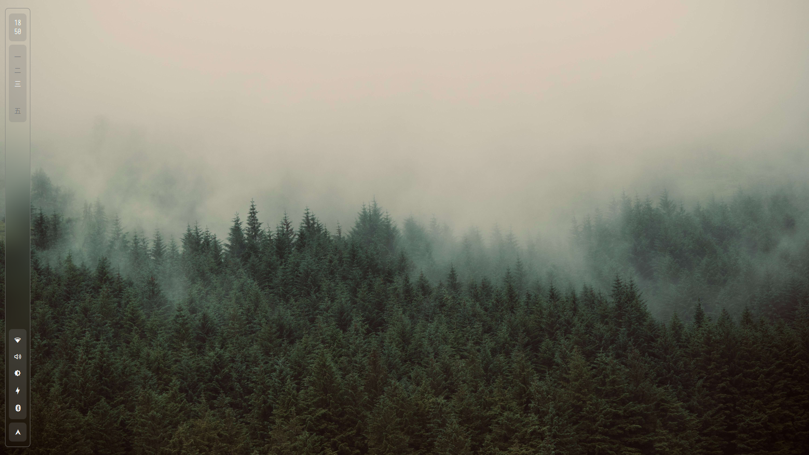
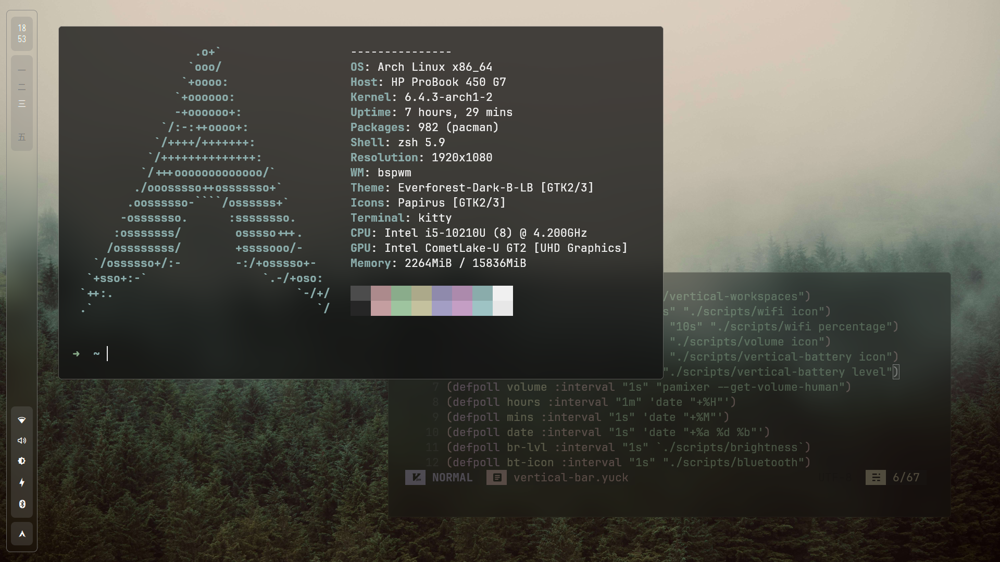
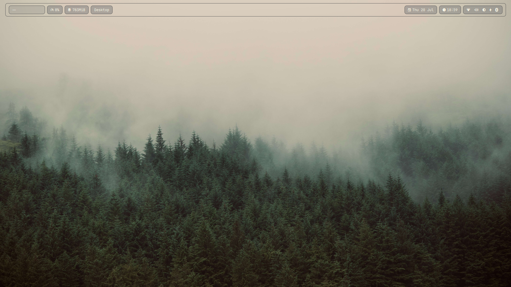
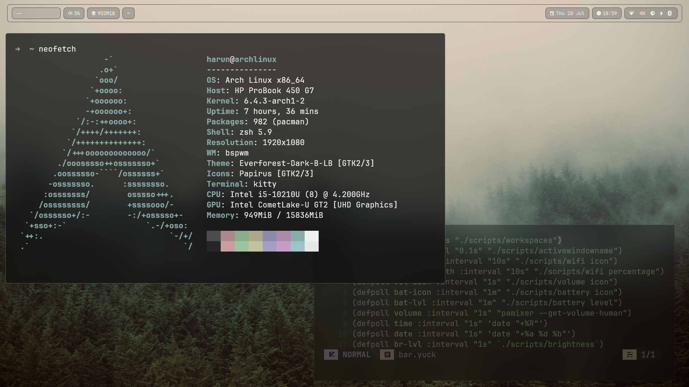

# BSPWM Dotfiles

### Vertical Bar

  
  

 

### Horizontal Bar

  
  

 

NOTE: The install scripts are just for my hardware after a fresh arch install. Please do not use them unless you plan to modify them. 

You can clone this branch with
`git clone -b bspwm https://github.com/sudo-harun/dotfiles.git`

Stuff I use:
<ul>
  <li><a href="https://github.com/adi1090x/rofi">Rofi Themes Collection</a></li>
  <li><a href="https://github.com/ranger/ranger">Ranger</a></li>
  <li><a href="https://github.com/ohmyzsh/ohmyzsh">ohmyzsh</a></li>
  <li><a href="https://nvchad.com">nvchad</a></li>
  <li><a href="https://github.com/betterlockscreen/betterlockscreen">betterlockscreen</a></li>
  <li><a href="https://github.com/mwh/dragon">dragon (with ranger)</a></li>
</ul>
